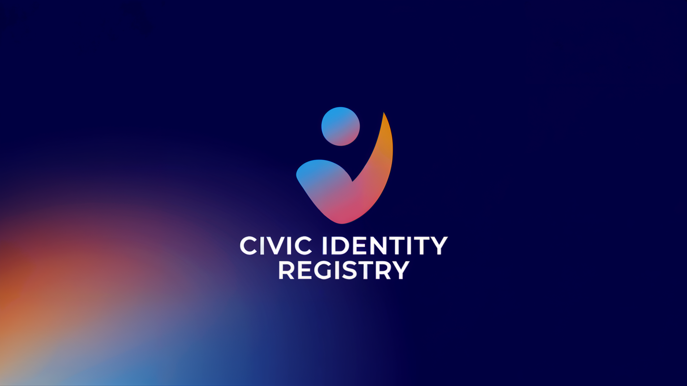

# Civic Identity Registry

## 🎯 About Us

Civic Identity Registry (CIR) is an open-source system for secure identity management, authentication, and self-governance.

## 🔗 Quick Links

| Resource                                              | Status | Description                    |
| ----------------------------------------------------- | ------ | ------------------------------ |
| [Website](https://civicidentity.org)                  | ✅     | Our official website           |
| [News Portal](https://news.civicidentity.org)         | 🔜     | Community-driven news platform |
| [Updates Hub](https://updates.civicidentity.org)      | 🔜     | Project updates and releases   |
| [GitHub](https://github.com/Civic-Identity-Registry)  | ✅     | Source code and documentation  |
| [BlueSky](https://bsky.app/profile/civicidentity.org) | ✅     | Social media updates           |

## 📄 License

All our repositories are licensed under the [Civic Identity Registry License (CIRL)](https://github.com/Civic-Identity-Registry/license). This custom license ensures the proper use and distribution of our software while maintaining the integrity of our mission.

## 🤝 Contributing

We welcome contributions from the community! If you're interested in contributing, please check our contribution guidelines in each repository.

---

  

    Built with ❤️ by the CIR Team
  

  

     2025 Civic Identity Registry. All Rights Reserved.
  

